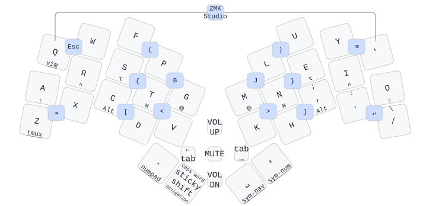
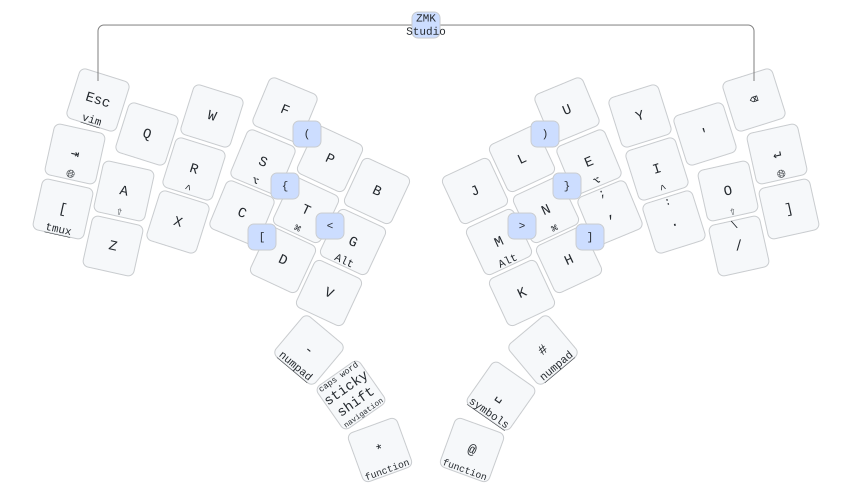

# Patagona Keyboards

Compact wireless ergo keyboards built around the [XIAO BLE][xiao] microcontroller
and running [ZMK][zmk] firmware with full [ZMK Studio][studio] support.
Named after the two species of giant hummingbird — the largest hummingbirds in the world.

## Features

- **Wireless** — internal LiPo battery; no cables required day to day
- **Live remapping** — ZMK Studio lets you customize your keymap over USB without recompiling firmware
- **Hotswap** — Kailh Choc sockets support both v1 and v2 switches; swap anytime
- **3D-printed case** — printable at home on any FDM printer, with split versions for smaller beds
- **Open hardware** — all source files included, licensed under [CERN-OHL-S-2.0][ohl]

## Patagona gigas

30–32 keys with a five-way joystick switch at the center,
within reach of either thumb for scroll, navigation, or mouse control.

[Build guide](BUILD-gigas.md) · [Cases](cases/gigas#readme) · [Firmware][firmware]

## Patagona chaski

40–42 keys for those who want the 3x6 layout and more thumb keys.

[Build guide](BUILD-chaski.md) · [Cases](cases/chaski#readme) · [Firmware][firmware]

## Heritage

The [Patagona genus][patagona-wiki] is home to the two largest hummingbirds in the world.
*P. gigas* is the migratory giant, ascending over 4,000 meters and traveling more than
4,000 km each way between the Chilean coast and the Peruvian Andes each year.
*P. chaski* is its slightly larger but sedentary cousin.

These keyboards follow the [Hummingbird layout][pje66] introduced by PJE66.
The original used a XIAO SAMD21 and topped out at 30 keys.
The Patagona boards use the XIAO BLE, whose NFC pads can be repurposed as GPIO —
adding two extra pins, enabling a 6×7 matrix and up to 42 keys.

[firmware]: https://github.com/ctranstrum/patagona-zmk
[ohl]: LICENSE.txt
[patagona-wiki]: https://en.wikipedia.org/wiki/Giant_hummingbird
[pje66]: https://github.com/PJE66/hummingbird
[studio]: https://zmk.dev/docs/features/studio
[xiao]: https://wiki.seeedstudio.com/XIAO_BLE/
[zmk]: https://zmk.dev
