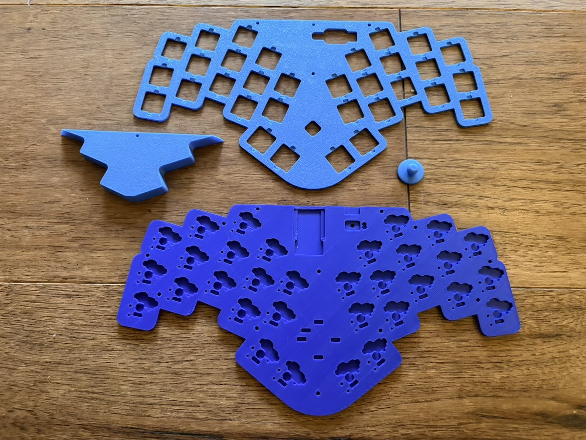
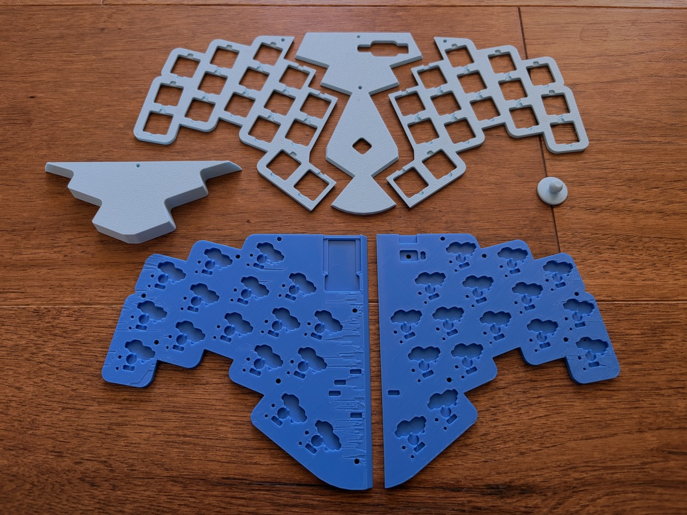
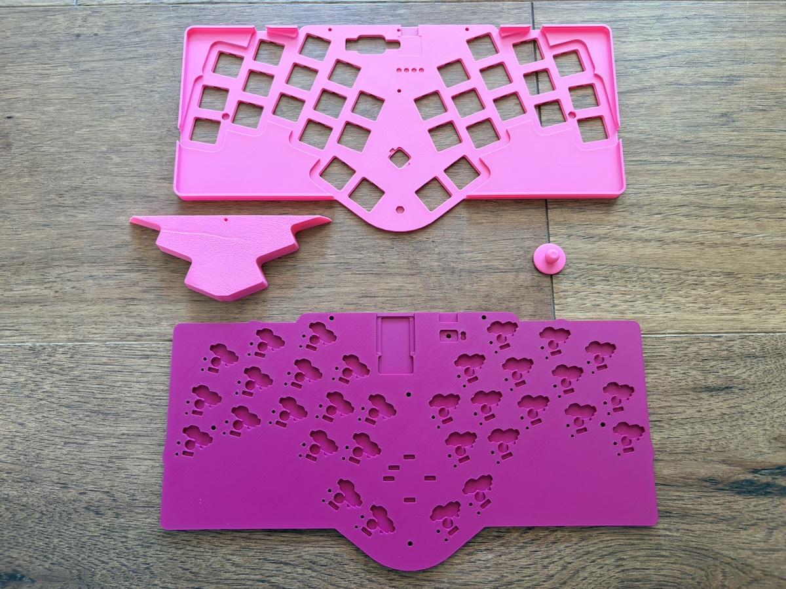

# Patagona Gigas Cases

> A quick note: these files were created through ergogen and can be
> modified and re-created if any changes are needed, which is great,
> except that the software is still a little bit buggy, so it doesn't
> make perfect STL files. Even though these can look a little strange,
> I have printed all of these files and they came out okay for me.

## Five-way switch cap

The five-way switch at the center of the Patagona gigas requires a cap to be usable.
The recommended cap is the [joystick style](../joystick.stl),
which fits snugly over the switch stem and provides a comfortable surface for navigation.

There is also an experimental [dpad style cap](../dpad.stl) available,
though after trying both, the joystick cap is the preferred option.

## Keyboard case files

### Full size printer

If you have access to your own 3D printer with a large print bed
or if you are sending the files away to be printed,
you will want to use the full size cases.

Print the following pieces:

- the bottom case
- your choice of one of the four top cases
- the battery cover
- the joystick knob

You can use the
[printer profile on makerworld](https://makerworld.com/en/models/3112971-patagona-gigas-keyboard-case#profileId-3510506)
or download the individual STL files:

| file                               | description                                                      |
| ---------------------------------- | ---------------------------------------------------------------- |
| [bottom](bottom_case.stl)          | installed below the PCB                                          |
| [top 1+1](top_case_1_1.stl)        | top case with one thumb key on each hand                         |
| [top 1+2](top_case_1_2.stl)        | top case with one thumb key on the left and two on the right     |
| [top 2+1](top_case_2_1.stl)        | top case with two thumb keys on the left and one on the right    |
| [top 2+2](top_case_2_2.stl)        | top case with two thumb keys on each hand                        |
| [battery cover](battery_cover.stl) | above the top plate to cover the battery (do not print in resin) |
| [joystick knob](../joystick.stl)   | knob for the central five-way switch                             |

Note that for best results on an FDM printer, the top plate and the battery cover should be printed upside down.

### Mini printer

If you have access to your own 3D printer
but it has a print bed too small for the full-size case,
you can print the case using these files.

Print the following pieces:

- the left and right bottom case
- the center top case
- your choice of one of the two top cases for the left hand
- your choice of one of the two top cases for the right hand
- the battery cover
- the joystick knob

You can use the
[printer profile on makerworld](https://makerworld.com/en/models/3112971-patagona-gigas-keyboard-case#profileId-3510558)
or download the individual STL files:

| file                                      | description                                                      |
| ----------------------------------------- | ---------------------------------------------------------------- |
| [bottom left](bottom_case_cut_left.stl)   | left bottom                                                      |
| [bottom right](bottom_case_cut_right.stl) | right bottom                                                     |
| [center](top_dovetail.stl)                | center top case dovetail piece                                   |
| [left 1](top_dovetail_left_1.stl)         | left top case piece with one thumb key                           |
| [left 2](top_dovetail_left_2.stl)         | left top case piece with two thumb keys                          |
| [right 1](top_dovetail_right_1.stl)       | right top case piece with one thumb key                          |
| [right 2](top_dovetail_right_2.stl)       | right top case piece with two thumb keys                         |
| [battery cover](battery_cover.stl)        | above the top plate to cover the battery (do not print in resin) |
| [joystick knob](../joystick.stl)          | knob for the central five-way switch                             |

Note that for best results on an FDM printer, the top plate and the battery cover should be printed upside down.

### Rectangular snap-fit case

I've also created an alternative case that uses fewer screws and instead relies on a snap-fit design
to remain securely fastened without sacrificing any additional height compared to the original sandwich design.

Unlike the sandwich-style cases, it is available only for full-size printer beds.

Print the following pieces:

- the bottom case
- your choice of one of the four top cases
- the battery cover
- the joystick knob

You can use the
[printer profile on makerworld](https://makerworld.com/en/models/3112971-patagona-gigas-keyboard-case#profileId-3510571)
or download the individual STL files:

| file                                  | description                                                     |
| ------------------------------------- | --------------------------------------------------------------- |
| [bottom](rectangle_bottom_case.stl)   | bottom case                                                     |
| [top 1+1](rectangle_top_case_1_1.stl) | top case with one thumb key on each hand                        |
| [top 1+2](rectangle_top_case_1_2.stl) | top case with one thumb key on the left and two on the right    |
| [top 2+1](rectangle_top_case_2_1.stl) | top case with two thumb keys on the left and one on the right   |
| [top 2+2](rectangle_top_case_2_2.stl) | top case with two thumb keys on each hand                       |
| [battery cover](battery_cover.stl)    | above the top case to cover the battery (do not print in resin) |
| [joystick knob](../joystick.stl)      | knob for the central five-way switch                            |

Note that it is especially important when printing this case style on an FDM printer to place the top case
upside down in the slicer so that the top surface of the case is in direct contact with the print bed.
Otherwise you are going to have a real struggle with support removal.

## Print quality hints

For best results, use the
[printer profile on makerworld](https://makerworld.com/en/models/3112971-patagona-gigas-keyboard-case).

When printing this case,
it should be noted that the battery cover is designed
to have heat-set inserts melted into it,
so it is not recommended to print using a resin printer
or using a material that cannot be melted easily,
unless you plan on altering the case design to use another method
to fasten the case together.

All other parts of the case can be printed in whatever material you like.

For FDM printing,
the top case and the battery cover are best printed upside down,
so that the visible part of the case is against the print bed,
giving the best top surface and requiring minimal supports to print.

If you are having trouble with some of the raised areas sagging during printing,
you can try to enable supports.
While I was able to tune my printer to get great results without supports,
if your printer is not well calibrated,
it may be worth it to enable supports and spend a little time
post-processing the prints to remove the supports prior to assembly.
